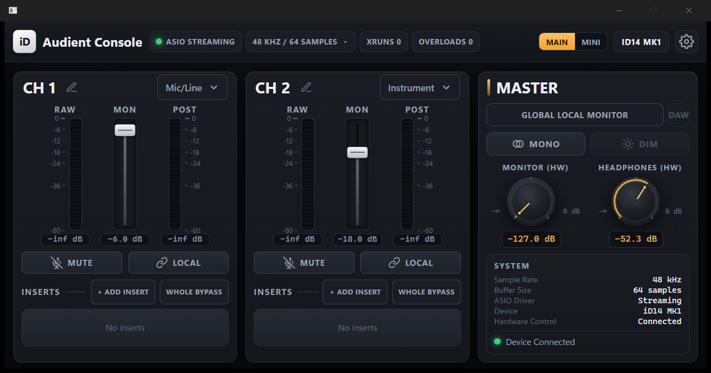
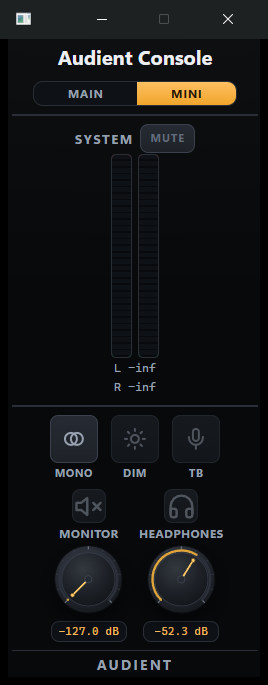

# Audient Console

An unofficial Windows mixer / VST3 host designed around the **Audient iD14 MK1**,
with low-latency ASIO processing, per-input VST3 chains, hardware output
control, compact Main/Mini interfaces, and optional Pico UAC2 virtual-mic
bridge support.

> **Audient Console is an unofficial community project and is not affiliated
> with, endorsed by, or supported by Audient Ltd.** "Audient" and "iD14" are
> trademarks of their respective owners and are used here only to describe
> compatibility.

## Screenshots

Main Mixer (dual input, per-channel insert racks):



Mini Monitor (SYSTEM meter + mute, mono, and hardware monitor/headphone
controls):



## Features

- **iD14 MK1 ASIO host** at 48 kHz, built around a realtime-safe engine
  (64 samples preferred / 128 accepted fallback).
- **CH1 / CH2** analogue inputs with an independent ordered VST3 chain per
  channel.
- **Persistent VST chain and state restore** — insert order, per-slot bypass,
  whole-chain bypass, and each plug-in's VST3 component state are saved and
  restored on the next launch.
- **Selectable virtual microphone source** — exactly one selected input
  (Input 1 or Input 2) feeds the virtual microphone; the sends are mutually
  exclusive (no summing, no cross-channel leakage).
- **RP2040 / RP2350 UAC2 Pico bridge support** — a class-compliant USB Audio
  Class 2 virtual-mic bridge (no custom Windows driver).
- **Monitor / Headphones hardware volume** via the official Audient user-mode
  API.
- **SYSTEM stereo meter** and **SYSTEM endpoint mute** for the Windows render
  endpoint.
- **Main / Mini UI**, native system tray behavior, and persistent settings.

## Deferred / not implemented

These are intentionally **not** implemented and are shown as unavailable in the UI:

- hardware-wide Mono
- independent Speaker mute
- independent Headphone mute
- Dim
- Talkback

The one SYSTEM mute control operates on the Windows render endpoint as a whole
(endpoint-wide); it is not an independent speaker/headphone mute. The Mini
SYSTEM meter is pre-mute and keeps moving while SYSTEM mute is engaged.

## Architecture overview

```text
Mic uplink
  iD14 input -> ASIO -> per-channel VST3 chain -> virtual microphone
             -> Discord / OBS / browser

System downlink
  Windows shared-mode mix -> virtual speaker render -> output VST3 chain/mixer
                          -> iD14 Output 1/2 (headphones/speakers)

iD14 hardware control
  UI command -> typed semantic model -> verified protocol adapter -> iD14
```

- Native C++20; the realtime ASIO callback is allocation-free, lock-free, and
  never touches the UI, files, or JSON.
- The Daily GUI is a native Windows shell hosting a local, offline WebView2
  frontend (no CDN, no remote assets).
- The Pico bridge is a standard UAC2 device; the app sends the selected
  post-VST mono signal to its playback endpoint.

## Requirements

- Windows 11 x64
- Audient iD14 MK1 with the official Audient driver installed
- Microsoft Edge **WebView2 Runtime** (Evergreen)
- Microsoft Visual C++ 2015–2022 x64 runtime (the Release installer includes it)
- Optional: an RP2040/RP2350 running the Audient Console Bridge firmware

## Building

```powershell
git clone <repo-url>
cd audientconsole
cmake --preset configure-debug
cmake --build --preset build-debug
ctest --preset test-debug
```

See **[docs/build.md](docs/build.md)** for prerequisites, the optional ASIO SDK,
the VST3/WebView2 dependencies, the frontend bundle, and the installer build.

## Installer / releases

The Windows installer is produced with Inno Setup from
`packaging/AudientConsole.iss` (per-user install under
`%LOCALAPPDATA%\Programs\Audient Console`). The installer checks for the
WebView2 Runtime and installs the VC++ x64 runtime if missing.

Built installers are distributed through **GitHub Releases**, not committed to
the source tree.

## Pico UAC2 bridge

An optional RP2040/RP2350 board running the Audient Console Bridge firmware
appears to Windows as a class-compliant UAC2 device (render capture pair).
Discovery matches the bridge by USB identity (`VID_1209` with `PID_B2DC`
(RP2040) or `PID_B2DD` (RP2350)) with a friendly-name fallback; the UAC2
endpoint contract is the same for both. The bridge transport is independent of
the ASIO engine — losing the bridge does not restart audio.

## Safety and disclaimer

- This is an unofficial, personal-use project. Use it at your own risk.
- It does not flash firmware, calibration, or factory regions on the iD14, and
  it does not install a kernel driver in this release.
- Start at a low physical monitor/headphone level. Keep a physical fallback
  (the official iD Mixer) available.
- Analog input gain and 48 V are physical controls and are not software-controlled.

## License and trademarks

Audient Console's own source is released under the **MIT License** (see
`LICENSE`). Third-party components retain their own licenses — see
`third_party/notices/` (which the build aggregates into `NOTICE.txt`) and
`docs/dependency-inventory.json`.

- **Steinberg VST3 SDK** (`vst3_pluginterfaces`, `vst3_base`, `vst3_public_sdk`)
  is pinned by commit and fetched at build time; the pinned snapshots are
  **MIT-licensed** (© Steinberg Media Technologies GmbH) and their notice is
  preserved in `third_party/notices/vst3.txt`.
- **Microsoft WebView2 SDK** and the **Microsoft SysVAD** driver sample are
  governed by their own terms; the SysVAD-derived driver source retains the
  Microsoft **MS-PL** notice.

**VST** is a registered trademark of Steinberg Media Technologies GmbH. It is
used here only descriptively (to indicate VST3 plug-in hosting). This product
does not use "VST" as part of its name and is not affiliated with Steinberg.
